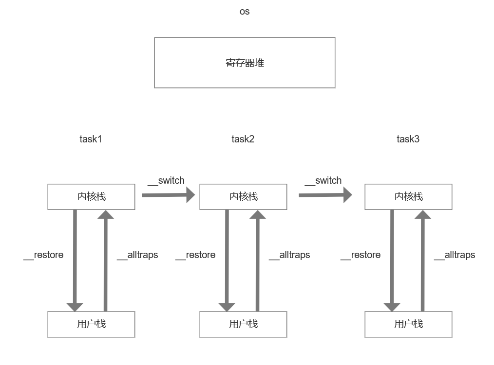
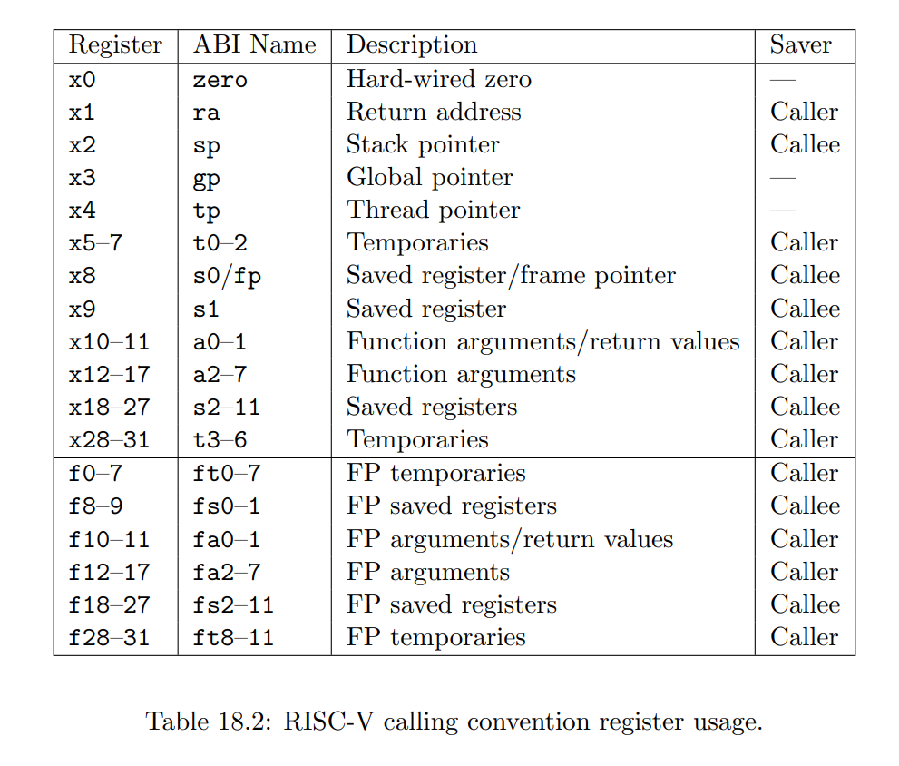

# ch3 实现分时多任务

在ch2里，是通过`app_dst.copy_from_slice(app_src);`把所有用户程序都装到APP_BASE_ADDRESS(0x80400000)这个位置执行的。这导致一次只能装入并运行一个程序。

ch3中，不把用户程序都搬到同一个位置，而是把每个用户程序都搬到各自的位置（os/src/loader.rs load_apps() `dst.copy_from_slice(src);`），且各自有自己的调用栈，通过时间片轮转的方式分时运行。

## 定制用户程序的开始地址

在os/src/loader.rs load_apps()中，通过`dst.copy_from_slice(src);`把用户程序整齐垒在0x80400000开头的多个块中。

## 任务切换

首先，对于**每个**任务，都要有对应的内核栈和用户栈：
```Rust
struct KernelStack {
    data: [u8; KERNEL_STACK_SIZE],
}

struct UserStack {
    data: [u8; USER_STACK_SIZE],
}

static KERNEL_STACK: [KernelStack; MAX_APP_NUM] = [KernelStack {
    data: [0; KERNEL_STACK_SIZE],
}; MAX_APP_NUM];

static USER_STACK: [UserStack; MAX_APP_NUM] = [UserStack {
    data: [0; USER_STACK_SIZE],
}; MAX_APP_NUM];
```



注意，分时多任务，**每个用户程序都要有一对内核栈和用户栈**，每个用户程序都要有个用户栈自不必说，为什么都要有自己独立的内核栈？比方说一个用户程序因为时间片用尽而__switch到下一个任务，那么当又轮到这个用户程序时，它会从run_next_task()中返回，然后一路到task_handler()返回，然后会pc + "1"走到__restore让自己恢复运行(trap.S里__restore就在call task_handler下面)。这个过程中都是用的内核栈，所以每个task必须有自己的内核栈，否则上述返回过程是别人的栈帧！

这解释了为什么进程内存空间的高地址是用户代码不可使用的[内核内存](https://github.com/plerks/mixed-tech-notes/blob/main/%E6%93%8D%E4%BD%9C%E7%B3%BB%E7%BB%9F%E7%9B%B8%E5%85%B3/%E5%85%B3%E4%BA%8E%E8%BF%9B%E7%A8%8B%E7%BA%BF%E7%A8%8B%E5%8D%8F%E7%A8%8B/%E5%85%B3%E4%BA%8E%E8%BF%9B%E7%A8%8B%E4%B8%8E%E7%BA%BF%E7%A8%8B.md#%E8%BF%9B%E7%A8%8B%E5%86%85%E5%AD%98%E7%A9%BA%E9%97%B4)，至少内核栈应该是在这块的，以前不理解。

### 如何切换任务？

**__switch函数的功能为**：将sp从一个内核栈切换到下一个内核栈，并恢复下一个要执行任务的内核态上下文。

__switch最后会ret，而ret会跳转到下一个任务的TaskContext.ra所指示的指令位置。

TaskContext的定义为：
```Rust
pub struct TaskContext {
    /// Ret position after task switching
    ra: usize,
    /// Stack pointer
    sp: usize, // 这里sp为内核栈顶
    /// s0-11 register, callee saved
    s: [usize; 12],
}
```

### TaskContext的ra存储的是什么？
最开始初始化时，通过goto_restore (os/src/task/context.rs)把TaskContext的ra赋值为了__restore的地址，顺着run_first_task()会调用到__switch，__switch里有`ld ra, 0(a1)`一行（执行之后ra寄存器为__restore地址），所以__switch ret之后会去调用__restore把用户程序跑起来。（ret会让程序跳到ra寄存器所指示的位置）

现在假设有3个用户程序A B C，现在C的时间片用完要切到A，trap之后调用run_next_task -> __switch，这时候__switch第一阶段`sd ra, 0(a0)`，这时候ra应该是run_next_task的返回地址，这个返回地址保存到了C的TaskContext的ra中，那么时间片轮转一圈。C -> A -> B，然后B时间片用完，现在要把C重新跑起来，__switch有`ld ra, 0(a1)`，这时候读出来的`0(a1)`(TaskContext的ra)不再是__restore的地址，那么__switch ret之后会跳到哪里去？__restore是怎么得到执行机会把C重新跑起来的？

这时候读出来的`0(a1)`会是run_next_task()的返回地址，不再是__restore了。这种情况下，C的内核调用栈会发生函数返回，直到trap_handler()这个函数返回，注意os/src/trap/trap.S中，call trap_handler之后紧接着就是__restore，所以会接着执行__restore切换到下一个用户程序执行！

ch2和ch3这里有点不一样，不会顺着执行__restore，ch2如果一个应用程序发生trap了，trap_handler处理后都会切换到下一个用户程序，会直接手动调一次__restore，就不会这样顺着走到__restore。不过这样好像trap_handler到__restore的函数无法返回，栈帧会一直积累？

### __switch为什么能切换用户程序
上面的分析的两种情况，__switch调用完成ret后都会执行到__restore，所以能从S态切换到U态执行用户程序。

### __switch是如何切换task的内核态上下文的？

**__switch切换的是两个用户程序在内核态的寄存器的上下文。**

**__restore做的是消费当前task在内核栈顶的TrapContext结构体，恢复用户程序在用户态的寄存器的上下文，并从S态转到U态开始执行用户程序。**

__switch的参数为`__switch(current_task_cx_ptr: *mut TaskContext, next_task_cx_ptr: *const TaskContext)`

**__switch做的事情是**：保存当前任务的sp和callee-saved寄存器的状态到current_task_cx_ptr，通过next_task_cx_ptr，把下一个任务的sp和callee-saved寄存器的值给恢复，将内核切换为下一个task的内核状态，然后再在末尾调用ret。

（__restore总是去读取sp栈顶的TrapContext以恢复用户程序的执行。所以，我们需要__switch函数，让sp指向我们想要运行的下一个用户程序的内核栈，然后让__restore去读sp栈顶的TrapContext以切换到想要运行的下一个用户程序。）

### 为什么__switch只需记录和恢复callee-saved寄存器？
先来看一个执行流是如何被切走和回来的，在run_next_task()中：
```Rust
fn run_next_task(&self) {
    if let Some(next) = self.find_next_task() {
        let mut inner = self.inner.exclusive_access();
        let current = inner.current_task;
        inner.tasks[next].task_status = TaskStatus::Running;
        inner.current_task = next;
        let current_task_cx_ptr = &mut inner.tasks[current].task_cx as *mut TaskContext;
        let next_task_cx_ptr = &inner.tasks[next].task_cx as *const TaskContext;
        drop(inner);
        // before this, we should drop local variables that must be dropped manually
        unsafe {
            __switch(current_task_cx_ptr, next_task_cx_ptr);
        }
        // go back to user mode
    } else {
        panic!("All applications completed!");
    }
}
```
假设当前在执行流A，run_next_task()里__switch(current_task_cx_ptr, next_task_cx_ptr);时，会跑到B的执行流里，暂时不会返回，等返回时callee-saved寄存器已由B的__switch恢复。而对于caller-saved寄存器，run_next_task中从__switch返回后有汇编代码恢复寄存器，所以run_next_task结束之后能恢复以前的状态。由于有run_next_task来恢复caller-saved寄存器，__switch里不用管caller-saved寄存器。

或者说，对于run_next_task的编译，如果在调用__switch后还需要用到caller-saved寄存器的值，则run_next_task会自行决定将值保存在栈中，并在__switch调用完成后恢复。也就是说caller-saved寄存器能按caller-saved语义自动恢复到执行流A切走时的状态。而__switch则需完成callee-saved语义，因为__switch是汇编代码中的符号，我们在rust代码run_next_task()中当成函数调用，rust编译器会帮我们完成传参，但是不会增加汇编代码完成callee-saved语义，我们需要在__switch中保存callee-saved寄存器并在恢复执行流时恢复。否则，执行流会看到：在自己执行__switch切换前，和从__switch返回恢复自己的执行流时，callee-saved寄存器的值变了（因为这时callee-saved寄存器是上个执行流的值），这不符合函数对callee-saved寄存器行为的假设，生成的汇编代码的执行正确性会有问题。

（关于caller-saved和callee-saved，更多内容见下面的一段）

### TaskContext和TrapContext的功能分别是什么？
TaskContext用于在S态从一个task切换到下一个task

TrapContext放置在task的内核栈栈顶，记录用户态下的寄存器上下文，__restore会消耗这个TrapContext恢复上下文，并从S态切换到U态执行用户程序。

### 每个task在内核栈顶的TrapContext结构体是刚好只有一个吗
是

TASK_MANAGER初始化时，会通过 init_app_cx -> push_context 往内核栈中推一个TrapContext结构体。（push_context在ch2.md中也有分析）

每调用一次__restore，TrapContext被消耗，用户程序从S态传到U态执行。

trap发生时，__alltraps又会往内核栈中补充一个TrapContext。（注意虽然此时是内核态，但是很多寄存器是用户程序的上下文，所以保存的上下文是用户态的上下文）

### 当发生任务切换时，切换到的目标任务是如何“接着”上次运行到的地方继续运行的？

时钟中断 -> 发生trap -> __alltraps -> trap_handler() -> run_next_task() -> __switch恢复下一个任务的内核态上下文 -> 下一个任务的内核栈函数调用返回 -> 下一个任务内核栈的trap_handler()返回 -> pc + "1"走到__restore，于是下一个任务得到执行

### yield
见[参考书](https://learningos.cn/rCore-Camp-Guide-2025S/chapter3/3multiprogramming.html)

比较容易就实现了yield，用户态调yield()会执行ecall触发trap，trap_handler识别trap类型为系统调用，然后调sys_yield()，切换成下一个任务运行就行了。

### 时间片轮转调度
见[参考书](https://learningos.cn/rCore-Camp-Guide-2025S/chapter3/4time-sharing-system.html)

也是比较简单就能实现时间片轮转调度，设置时钟中断的定时触发，触发时会trap，然后trap_handler识别trap类型为时钟中断，然后切换成下一个任务运行就行了。

（以前只存在于想象的定时切换任务居然并不需要多少代码就能实现了）

### 当正从一个任务切换到下一个任务时(当前在S态进行切换)，会不会这时又出现时钟中断？
[参考书, RISC-V 架构中的嵌套中断问题](https://learningos.cn/rCore-Camp-Guide-2025S/chapter3/4time-sharing-system.html#risc-v)：

```
默认情况下，当 Trap 进入某个特权级之后，在 Trap 处理的过程中同特权级的中断都会被屏蔽。

当 Trap 发生时，sstatus.sie 会被保存在 sstatus.spie 字段中，同时 sstatus.sie 置零， 这也就在 Trap 处理的过程中屏蔽了所有 S 特权级的中断；

当 Trap 处理完毕 sret 的时候， sstatus.sie 会恢复到 sstatus.spie 内的值。

也就是说，如果不去手动设置 sstatus CSR ，在只考虑 S 特权级中断的情况下，是不会出现 嵌套中断 (Nested Interrupt) 的。


嵌套中断与嵌套 Trap

嵌套中断可以分为两部分：在处理一个中断的过程中又被同特权级/高特权级中断所打断。默认情况下硬件会避免前一部分， 也可以通过手动设置来允许前一部分的存在；而从上面介绍的规则可以知道，后一部分则是无论如何设置都不可避免的。

嵌套 Trap 则是指处理一个 Trap 过程中又再次发生 Trap ，嵌套中断算是嵌套 Trap 的一种。
```

## caller-saved寄存器与callee-saved寄存器
参考:
* https://blog.csdn.net/l919898756/article/details/103142439
* https://stackoverflow.com/questions/9268586/what-are-callee-and-caller-saved-registers
* https://zhuanlan.zhihu.com/p/462483036


caller-saved寄存器（**易失性寄存器、临时寄存器**）指：如果一个函数f内部要调另外一个函数g，那么对于caller-saved寄存器，如果f在调用g后还需要使用的话，必须自己提前把寄存器值保存在栈中，调完g后再恢复，而不能假设g会帮自己维护这些寄存器的值。如果f后面不关心caller-saved寄存器的值，那么让其值被修改，自己不去存储恢复也无所谓（比如f后面不需要用到这些寄存器了）。

而对于callee-saved寄存器（**非易失性寄存器、保存寄存器**）：f**可以假定**g内部就算要改变这类寄存器，最后g返回前也会把值改回来。当然，g如果真的改了这类寄存器的值，也真的要在返回前恢复回去。

也就是说，caller-saved规范是：函数要为了自己记录寄存器值，谨慎准备；callee-saved规范是：函数要为了外部保持寄存器值不变，约束自己。

用：**寄存器的存储 可以易失、临时性 / 不能易失、非临时性** ，比起叫caller-saved和callee-saved更好理解。

[RISC-V calling convention register usage](https://riscv.org/wp-content/uploads/2024/12/riscv-calling.pdf):



为什么__switch不用考虑caller-saved规范？

因为__switch内部根本没调别的函数，是个叶子节点，只有callee-saved规范的概念。

其它几个汇编写的函数有没有体现这两种概念？

有。以os/src/trap/trap.S __alltraps为例，__alltraps末尾才会调trap_handler，就算trap_handler会改变一些寄存器的值而不恢复，那__alltraps也不关心了，因为trap_handler返回之后自己就执行完了，不用考虑caller-saved规范（除非trap_handler之后__alltraps函数还有内容）。对于callee-saved规范，__alltraps代码中只涉及到sp这个callee-saved寄存器，__alltraps确实遵循了callee-saved规范，只是比较另类 —— 直接换栈了。

为什么__switch要主动实现callee-saved规范？

__switch实现callee-saved规范的方式也比较另类，当前执行流(比方说A)的__switch只是把callee-saved寄存器保存在了A的TaskContext中，然后A执行流就被挂起，切换到B执行流了，直到B执行流时间片用尽，返回A时，这时A执行流中callee-saved寄存器的值才被真正恢复。（为了外部函数的运行正常，必须约束自己，在自身运行结束后保证不改变callee-saved寄存器。而对于caller-saved类的寄存器，外部函数若是担心被子函数改了，该自己动手保存。）

## 实验的本地运行测试
ch3开始需要完成代码，这里记一下怎么本地运行。

[参考书](https://learningos.cn/rCore-Camp-Guide-2025S/chapter3/5exercise.html#id5)：
```
默认情况下，makefile 仅编译基础测例 (BASE=1)，即无需修改框架即可正常运行的测例。 你需要在编译时指定 BASE=0 控制框架仅编译实验测例（在 os 目录执行 make run BASE=0）， 或指定 BASE=2 控制框架同时编译基础测例和实验测例。
```
也就是说，本地运行user/bin下的基础和实验测例，命令为`LOG=DEBUG make run BASE=2`。

user/src/bin下放了所有章节的.rs文件，但是只会编译到当前分支章节的，具体逻辑在os/Makefile和user/Makefile里

基础测例是文件名章节数字后面没b的，比如ch3_sleep.rs，实验测例是文件名章节数字后面带b的，比如ch2b_bad_address.rs

如果要运行更多用例，见/README.md，Grading那段:
```bash
# Replace <YourName> with your github ID 
$ git clone git@github.com:LearningOS/2025s-rcore-<YourName>
$ cd 2025s-rcore-<YourName>
$ rm -rf ci-user
$ git clone git@github.com:LearningOS/rCore-Tutorial-Checker-2025S ci-user
$ git clone git@github.com:LearningOS/rCore-Tutorial-Test-2025S ci-user/user
$ git checkout ch<Number>
$ cd ci-user
$ make test CHAPTER=<Number>
```