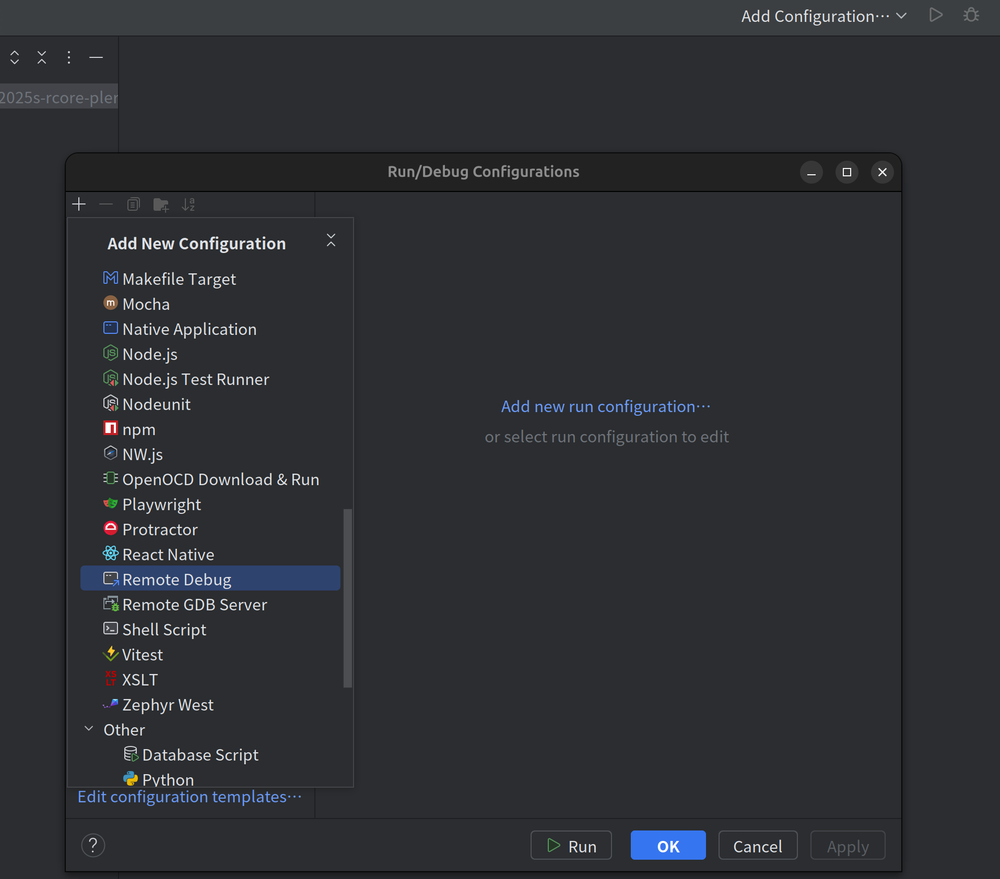

# ch4实现用户虚拟地址空间
这篇只记录下测试和调试的方法，以及列下一些关键点，具体的代码见[仓库](https://github.com/LearningOS/2025s-rcore-plerks/tree/ch4)。

## 测试命令
再列下测试的命令：

* 方式1：os/目录下：`LOG=DEBUG make run BASE=2`

* 方式2：/README.md，Grading那段，ci-user这个测试仓clone好之后，在ci-user/目录下：`make test CHAPTER=4`

## 手动调试
以调试ch3 os/src/syscall/process.rs sys_trace() 函数为例，**以下假定已切换到ch3分支**。参考[指导书](https://learningos.cn/rCore-Camp-Guide-2025S/0setup-devel-env.html#gdb)和rcore-camp群友[loukas](https://github.com/miwumiwumilumilelu)的指导。

首先，在`os/Makefile`中将`MODE := release`改成`MODE := debug`。

然后，修改`os/src/entry.asm`，**把栈改大**，注意这很重要！不然`(gdb) c`之后会只提示"Continuing."停不下来，不知道具体原因，可能是爆栈了，然后取指到奇怪的地方去了。

修改os/src/entry.asm：
```asm
boot_stack_lower_bound:
    .space 409600 * 16 # 原来是 4096 * 16，改大
    .globl boot_stack_top
boot_stack_top:
```

---

但是不理解的是: **TODO:** 为什么把这个boot_stack改大能行，这个boot_stack应该是os刚启动时用的stack，后面就再也不会用到了，这个boot_stack和用户进程的内核栈os/src/loader.rs KernelStack还不一样。

在os/src/trap/mod.rs trap_handler()开头加上：
```Rust
let sp: usize;
unsafe {
    core::arch::asm!("mv {}, sp", out(reg) sp);
}
extern "C" {
    fn boot_stack_lower_bound();
    fn boot_stack_top();
}
assert!(sp < boot_stack_lower_bound as usize || sp >= boot_stack_top as usize);
```
这个assert是能通过的，也就是说后面确实没有在用这个boot_stack，那为什么把这个boot_stack改大能work?

---

**把gdb server运行起来:**
在`os/`目录下，`LOG=DEBUG make gdbserver BASE=2`，BASE=2指定运行user/bin中的所有实验用例和基础用例，make gdbserver的作用是把qemu运行起来，并让它在localhost:1234上等待GDB的调试连接（Makefile规则里的-S含义为让QEMU启动后立刻暂停，-s相当于 -gdb tcp::1234，在1234开启gdb调试端口）。

**注意**：对ch3想调试sys_trace函数的例子，必须写`BASE=2`，不然user/Makefile不会编译user/src/bin/ch3_trace.rs这个用例，ch[0-3]只有这个用例调了sys_trace()，没编译这个用例，函数永远不会停在sys_trace()的地方，程序运行完就结束了。（而你可能迷惑为什么没停下，实际上断点处的代码根本没被执行）

**把gdb client运行起来:**
现在运行gdb客户端，我们要使用基于riscv64平台的gdb调试器 riscv64-unknown-elf-gdb（见[指导书](https://learningos.cn/rCore-Camp-Guide-2025S/0setup-devel-env.html#gdb)）。

执行`riscv64-unknown-elf-gdb`，进入gdb的命令提示符之后：

指定可执行文件：`file target/riscv64gc-unknown-none-elf/debug/os`（注意这里要对上build出的os这个可执行文件的路径，这样写当前目录要为`os/`）

gdb作为客户端连接localhost:1234：`target remote localhost:1234`

下断点：`b sys_trace`

运行：`c`

停住之后：`list`看附近源码，`info locals`看局部变量，`p _id`打印变量_id的值，`next`执行到下一行

## 在VSCode中调试
首先，每次用gdb client调试之前，要把gdb server运行起来：`LOG=DEBUG make gdbserver BASE=2`。一次调试结束之后要重新启动gdb server。

VSCode launch.json配置:
```json
{
    "version": "0.2.0",
    "configurations": [
        {
            "name": "Remote Debug rCore",
            "type": "cppdbg",
            "request": "launch",
            "MIMode": "gdb",
            "miDebuggerPath": "/home/gxy/riscv64-unknown-elf-gcc-8.3.0-2020.04.1-x86_64-linux-ubuntu14/bin/riscv64-unknown-elf-gdb", // riscv64-unknown-elf-gdb 路径
            "cwd": "${workspaceFolder}",
            "program": "${workspaceFolder}/os/target/riscv64gc-unknown-none-elf/debug/os",
            "setupCommands": [
                {
                    "description": "Set a breakpoint at main",
                    "text": "file ${workspaceFolder}/os/target/riscv64gc-unknown-none-elf/debug/os", // 指定可执行文件路径
                    "ignoreFailures": true
                },
                {
                    "description": "Connect to QEMU GDB remote",
                    "text": "target remote localhost:1234", // 连接gdb server
                    "ignoreFailures": false
                },
                // {
                //     "description": "Set a breakpoint at main",
                //     "text": "b sys_trace", // setupCommands里直接在sys_trace处下断点，这个setupCommand不写，直接在VSCode UI里打断点也行
                //     "ignoreFailures": true
                // },
            ],
            "stopAtEntry": false,
            "externalConsole": false
        }
    ]
}

```
在VSCode里打好断点，然后左侧Run and Debug里选择Remote Debug rCore运行。

**注意**：可能是因为我们的代码会触发trap，而riscv64-unknown-elf-gdb能检测到发生了异常，所以断点停下后VSCode会有这样的提示：


可以放心继续运行，step over就行。

## 在CLion中调试
**得用Clion**，用RustRover不行，因为我们要用Remote Debug这个configuration，RustRover里没有，CLion里才有。

首先要把gdb server运行起来：`LOG=DEBUG make gdbserver BASE=2`。

配置CLion的步骤为：

1. 点Add Configuration，选择Remote Debug这个配置:

    

2. 设置gdb路径，gdb server地址，可执行文件路径：

    

3. 点debug运行就能停住了：

    

---

如果是ch2，就算按上面正确操作了，应该也是无法断下来的，因为ch2的批处理方式是把用户程序app_i从内存搬到了专门运行的地方 (ps: 如果是完全复刻批处理，用户程序原本应当放外存中)，打断点的地方最后实际不会被取指，也就无法断下来。（猜测应该会这样，没去试）

试了下ch4，以上步骤之后能停住。

**这里有个有意思的问题**，qemu运行起来后，为什么用riscv64-unknown-elf-gdb可以调试它？我们甚至都还没进程的概念，可执行文件里的调试信息是什么样的？断点的原理是换成int 3指令(risc-v为ebreak)，对于直接使用物理地址或实现了虚拟地址空间，riscv64-unknown-elf-gdb怎么知道该去内存哪里换指令的？

直接使用物理地址的情况很好理解，不多说。对于我们现在ch4实现了虚拟地址空间的情况，我的理解是：比如我`b sys_trace`，sys_trace是os/的代码，而内核态整个地址空间都是恒等映射，所以可执行文件调试信息里的sys_trace的地址(链接器最后会计算出来sys_trace这个符号的地址)，最后在恒等映射下就会是物理地址，所以gdb按符号表里的地址去把内存改成ebreak指令的内容，刚好能触发断点。这样看来，**以上调试步骤只能对os/的代码work**（user/不是恒等映射，打断点应该是不能work，没去试）

## 自定义用例运行（例如只运行单个用例）
修改user/Makefile，修改里面编译user/src/bin下的哪些文件的逻辑，TESTS控制编译哪些章的用例，文件名被枚举到了APPS中，所以手动设定这两个变量的值即可自定义逻辑。
```Makefile
else
	TESTS := $(shell seq $(BASE) $(TEST))
	# TESTS := $(shell seq 0 3) # 只运行[0, 3]章的用例
	ifeq ($(BASE), 0) # Normal tests only
		APPS := $(foreach T, $(TESTS), $(wildcard $(APP_DIR)/ch$(T)_*.rs))
	else ifeq ($(BASE), 1) # Basic tests only
		APPS := $(foreach T, $(TESTS), $(wildcard $(APP_DIR)/ch$(T)b_*.rs))
	else # Basic and normal
		APPS := $(foreach T, $(TESTS), $(wildcard $(APP_DIR)/ch$(T)*.rs))
	endif
	# APPS = $(APP_DIR)/ch4_mmap0.rs # 在这里赋值APPS实现跑单个用例
endif
```
修改后用`LOG=DEBUG make run BASE=2`运行。

---

# 关于ch4实验的内容
这里只简略记点关键点，代码在[这里](https://github.com/LearningOS/2025s-rcore-plerks/tree/ch4)，报告在[这里](https://github.com/LearningOS/2025s-rcore-plerks/blob/ch4/reports/lab2.md)。代码里有注释，报告里有相当于笔记的内容。

## 多级页表

[rcore tutorial](https://rcore-os.cn/rCore-Tutorial-Book-v3/chapter4/3sv39-implementation-1.html#id6)有讲多级页表的树结构，不止是能够避免线性表必须连续分配超大的连续物理页面以存储页表项。而且当这棵树某个分支一个叶子都没有的话，那么只需记录整个子树是空的就行，根本不用记录到第三级（SV39模式三级页表），也就是说，改成树结构，页表的总占用空间也是能省的。不过这会受树结构影响。

[rcore tutorial](https://rcore-os.cn/rCore-Tutorial-Book-v3/chapter4/3sv39-implementation-1.html#id6)有分析页表的内存占用，在"分析 SV39 多级页表的内存占用"那部分。

结论为：设某个应用地址空间实际用到的区域总大小为 $S$ 字节，则地址空间对应的多级页表消耗内存为 $ \frac{S}{512} $ 左右。不过这会受树结构影响，例如树的每条到叶节点的路径都很细，或者虚拟地址空间全被分配，这种情况树化的结构的空间利用率就不高。

## 恒等映射

关于恒等映射的场景，哪些场景下是恒等映射？

内核态整个地址空间都是恒等映射。不过开启分页之后内核态cpu取指还是会走页表查，所以我们要为内核态也维护页表，不过是恒等映射的页表，等同于直接使用物理地址。

在new_kernel()函数中映射了整个内核需要用到的虚拟地址空间（恒等映射），例如内核代码的.text, .rodata段等等，机器开启了分页模式，即使内核态访问内存也会自动去查页表转换地址，所以内核也必须为机器准备页表（即使是恒等映射）。ekernel ~ MEMORY_END这部分被用作了FRAME_ALLOCATOR的物理页帧资源，会被分配给用户程序，要让这些页处于内核的地址空间中（插到页表中），不然像translated_byte_buffer()这类函数在内核态就无法实现读用户地址空间了（MMU地址转换会失败）。

内核不需要虚拟自己的地址空间，所以直接采用恒等映射，不然徒增麻烦，且还有开启分页的瞬间前后，要能继续取指执行的需求。（[rcore tutorial](https://learningos.cn/rCore-Camp-Guide-2025S/chapter4/6multitasking-based-on-as.html#id2)中的"连续性"概念）：

```
PageTable::token 会按照 satp CSR 格式要求 构造一个无符号 64 位无符号整数，使得其 分页模式为 SV39 ，且将当前多级页表的根节点所在的物理页号填充进去。在 activate 中，我们将这个值写入当前 CPU 的 satp CSR ，从这一刻开始 SV39 分页模式就被启用了，而且 MMU 会使用内核地址空间的多级页表进行地址转换。

我们必须注意切换 satp CSR 是否是一个 平滑 的过渡：其含义是指，切换 satp 的指令及其下一条指令这两条相邻的指令的 虚拟地址是相邻的（由于切换 satp 的指令并不是一条跳转指令， pc 只是简单的自增当前指令的字长）， 而它们所在的物理地址一般情况下也是相邻的，但是它们所经过的地址转换流程却是不同的——切换 satp 导致 MMU 查的多级页表 是不同的。这就要求前后两个地址空间在切换 satp 的指令 附近 的映射满足某种意义上的连续性。

幸运的是，我们做到了这一点。这条写入 satp 的指令及其下一条指令都在内核内存布局的代码段中，在切换之后是一个恒等映射， 而在切换之前是视为物理地址直接取指，也可以将其看成一个恒等映射。这完全符合我们的期待：即使切换了地址空间，指令仍应该能够被连续的执行。
```

用户态整个地址空间都是页式存储管理（代码里的MapType::Framed）。

## 双页表与单页表
把[报告](https://github.com/LearningOS/2025s-rcore-plerks/blob/ch4/reports/lab2.md)里记的搬过来：

[rcore-camp指导书](https://learningos.cn/rCore-Camp-Guide-2025S/chapter4/7exercise.html):

为了防范侧信道攻击，我们的 os 使用了双页表。但是传统的设计一直是单页表的，也就是说， 用户线程和对应的内核线程共用同一张页表，只不过内核对应的地址只允许在内核态访问。 (备注：这里的单/双的说法仅为自创的通俗说法，并无这个名词概念，详情见 [KPTI](https://en.wikipedia.org/wiki/Kernel_page-table_isolation) )

关于单页表和双页表的解释，见[rcore tutorial](https://rcore-os.cn/rCore-Tutorial-Book-v3/chapter4/6multitasking-based-on-as.html#term-trampoline)，"内核与应用地址空间的隔离"一段：

---

目前我们的设计思路 A 是：对内核建立**唯一的内核地址空间**存放内核的代码、数据，同时对于每个应用维护一个它们自己的用户地址空间，因此在 Trap 的时候就需要进行地址空间切换，而在任务切换的时候无需进行（因为这个过程全程在内核内完成）。

另外的一种设计思路 B 是：让每个应用都有一个包含应用和内核的地址空间，并将其中的逻辑段分为内核和用户两部分，分别映射到内核/用户的数据和代码，且分别在 CPU 处于 S/U 特权级时访问。此设计中并不存在一个单独的内核地址空间。

---