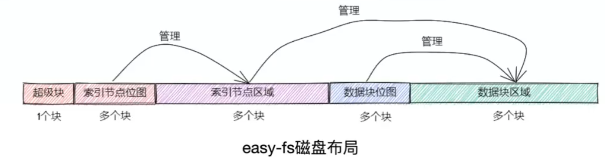
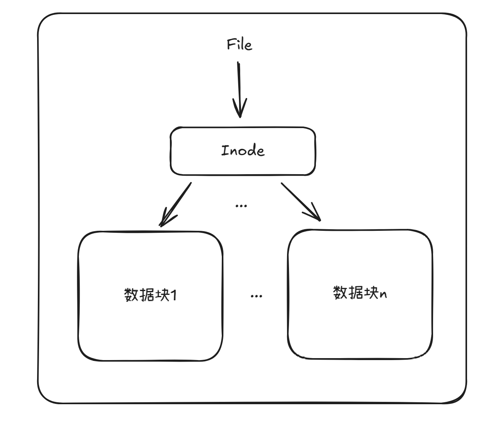

# ch6实现一个极简的文件系统 – easyfs
[rcore-camp-guide](https://learningos.cn/rCore-Camp-Guide-2025S/chapter6/1fs-interface.html#id2):

与课堂所学相比，我们实现的文件系统进行了很大的简化：

* 扁平化：仅存在根目录 / 一个目录，所有的文件都放在根目录内。直接以文件名索引文件。

* 不设置用户和用户组概念，不记录文件访问/修改的任何时间戳，不支持软硬链接。

* 只实现了最基本的文件系统相关系统调用。

* 本教程只实现文件的顺序读写，而不考虑随机读写。

---

ch6多了两个目录，`easy-fs/`和`easy-fs-fuse/`。

easy-fs是我们实现的文件系统，里面定义并实现了各种文件系统库函数。

easy-fs会被os和easy-fs-fuse当做库进行使用，在os/和easy-fs-fuse/的cargo.toml中，easy-fs都被作为了dependency引入。

easy-fs-fuse的目的是利用easy-fs作为库，把我们的用户程序写入`fs.img`文件（见os/Makefile的fs-img规则）。这个文件等价于我们的文件系统镜像。在os启动时，将fs.img作为块设备加载到qemu模拟器中，这样os/启动时qemu中就有一块磁盘，其中存好了我们的用户程序。

[在启动Qemu模拟器的时候，配置参数来添加了一块VirtIO块设备](https://learningos.cn/rCore-Camp-Guide-2025S/chapter6/3using-easy-fs-in-kernel.html#id1)：
```Makefile
# os/Makefile

FS_IMG := ../user/target/$(TARGET)/$(MODE)/fs.img

run: build
    @qemu-system-riscv64 \
        -machine virt \
        -nographic \
        -bios $(BOOTLOADER) \
        -device loader,file=$(KERNEL_BIN),addr=$(KERNEL_ENTRY_PA) \
        -drive file=$(FS_IMG),if=none,format=raw,id=x0 \
        -device virtio-blk-device,drive=x0,bus=virtio-mmio-bus.0
```

## 具体的读写磁盘逻辑在哪里实现？

easy-fs-use具体是怎么做的？

easy-fs中有个抽象类BlockDevice，其定义了read_block和write_block两个接口函数，然后我们文件系统easy-fs的实现底层是调这两个方法，实现将内容写到具体的"磁盘"。

也就是说，外部向easy-fs库提供了这两个函数的实现，从而实现了具体的读写"磁盘"。

而在easy-fs-fuse/src/main.rs中，有`impl BlockDevice for BlockFile {`，这部分代码定义了BlockFile这个类型，并impl BlockDevice，但是其read_block和write_block的具体实现是往fs.img中写入内容。于是fs.img就会被easy-fs当做"磁盘"。于是就能通过easy-fs-fuse生成磁盘镜像了。

而在os/src/drivers中，有`impl BlockDevice for VirtIOBlock {`，在其read_block和write_block实现中，直接使用了virtio-drivers库(见os/cargo.toml的[dependencies])实现read_block和write_block，这样进模拟器之后就能确实地读写qemu中的磁盘了。

在os/src/drivers/block/mod.rs中，有：
```Rust
type BlockDeviceImpl = virtio_blk::VirtIOBlock;

lazy_static! {
    /// The global block device driver instance: BLOCK_DEVICE with BlockDevice trait
    pub static ref BLOCK_DEVICE: Arc<dyn BlockDevice> = Arc::new(BlockDeviceImpl::new());
}
```

也就是说，在easy-fs-fuse中，BlockFile抽象了我们的BlockDevice。

在os中，VirtIOBlock抽象了我们的BlockDevice。我们只当`BLOCK_DEVICE`就是我们的磁盘设备就行了。

## 几个关键的初始化
os/src/drivers/block/mod.rs中：
```Rust
type BlockDeviceImpl = virtio_blk::VirtIOBlock;

lazy_static! {
    /// The global block device driver instance: BLOCK_DEVICE with BlockDevice trait
    pub static ref BLOCK_DEVICE: Arc<dyn BlockDevice> = Arc::new(BlockDeviceImpl::new());
}
```
如上所述这代表我们的磁盘设备。

easy-fs/src/block_cache.rs中：
```Rust
lazy_static! {
    /// The global block cache manager
    pub static ref BLOCK_CACHE_MANAGER: Mutex<BlockCacheManager> =
        Mutex::new(BlockCacheManager::new());
}
```
这个 BLOCK_CACHE_MANAGER 中存放 BlockCache，作为磁盘块在内存中的cache。且其能自动完成内存中的 BlockCache 和真正的磁盘块的同步。

os/src/fs/inode.rs中：
```Rust
lazy_static! {
    /// root inode
    pub static ref ROOT_INODE: Arc<Inode> = {
        let efs = EasyFileSystem::open(BLOCK_DEVICE.clone());
        Arc::new(EasyFileSystem::root_inode(&efs))
    };
}
```
ROOT_INODE 是我们初始化文件系统时，加载到内存中的根目录`/`的Inode。内存中有了根目录的Inode才能有个查找、读写文件的入口。EasyFileSystem::open 打开了我们通过 easy-fs-fuse 创建好的存到了磁盘中的文件系统。

## easy-fs磁盘布局
见[rcore-camp-guide](https://learningos.cn/rCore-Camp-Guide-2025S/chapter6/2fs-implementation-1.html#id6):

---

easy-fs 磁盘按照块编号从小到大顺序分成 5 个连续区域：

第一个区域只包括一个块，它是 **超级块** (Super Block)，用于**定位其他连续区域的位置**，检查文件系统合法性。

第二个区域是一个索引节点位图，长度为若干个块。它记录了索引节点区域中有哪些索引节点已经被分配出去使用了。

第三个区域是索引节点区域，长度为若干个块。其中的每个块都存储了若干个索引节点。

第四个区域是一个数据块位图，长度为若干个块。它记录了后面的数据块区域中有哪些已经被分配出去使用了。

最后的区域则是数据块区域，其中的每个被分配出去的块保存了文件或目录的具体内容。

---

[rcore-camp课程](https://opencamp.cn/os2edu/camp/2025spring/stage/2?tab=video)，2025年4月30日的课堂的讲课中，课件里的这个图总结了磁盘布局关系：



## DiskInode和Inode
这两种类型分别定义在easy-fs/src/layout.rs和easy-fs/src/vfs.rs中。DiskInode的结构定义与磁盘块的Inode结构相同，而Inode记录了block_id和block_offset，**Inode和DiskInode一一对应**。可以把Inode看做更靠近用户层面的封装。

[注意](https://learningos.cn/rCore-Camp-Guide-2025S/chapter6/2fs-implementation-1.html#id10)：

> 为了充分利用空间，我们将 DiskInode 的大小设置为 128 字节，每个块正好能够容纳 4 个 DiskInode 。在后续需要支持更多类型的元数据的时候，可以适当缩减直接索引 direct 的块数，并将节约出来的空间用来存放其他元数据，仍可保证 DiskInode 的总大小为 128 字节。

所以Inode要 block_id + block_offset 才能对应上DiskInode，见easy-fs/src/efs.rs get_disk_inode_pos()。

DiskInode提供了`read_at`和`write_at`两个关键方法，可以读写DiskInode所代表文件的**数据部分**。其通过`get_block_cache`实现。

Inode提供了`read_disk_inode`和`modify_disk_inode`两个关键方法，可以直接读写当前Inode对应的DiskInode。**注意是读写DiskInode本身，不是读写DiskInode所代表文件的数据部分**。

Inode和DiskInode都是在内存中的，其有一套同步到真正的磁盘块的机制，想读写磁盘块时会调用`get_block_cache`这个函数，这就涉及到启动时初始化的那个BLOCK_CACHE_MANAGER了，读写磁盘会通过block cache进行，BLOCK_CACHE_MANAGER会帮我们管理磁盘块的缓存与同步。于是，只要对着BLOCK_CACHE_MANAGER中的block cache读写（在内存中），**就好像真的读写了磁盘块**。

`read_disk_inode`和`modify_disk_inode`的使用方式有些特别，其参数需要我们传入一个闭包，这个闭包函数会被调用，完成具体的读写逻辑。前面提到，Inode和DiskInode是一一对应的，read_disk_inode承诺会将对应的DiskInode作为我们的闭包参数传入，于是，闭包函数体就是我们要写的读写DiskInode的逻辑。然后再通过BLOCK_CACHE_MANAGER来自动同步。**这样就完成了读写DiskInode**。

## File和OSInode
os/src/fs/mod.rs中定义了`File`这个trait，其代表一个File对象，作用相当于抽象类，定义了`read()`、`write()`等读写文件的函数。

os/src/fs/inode.rs中的`OSInode`是`File`这个抽象类的具体实现。（OSInode这个名字有点误导，取这个名字应该是因为其内部有包裹文件的Inode，其更像File类型）

## 缓存同步问题
[rcore-camp-guide](https://learningos.cn/rCore-Camp-Guide-2025S/chapter6/2fs-implementation-2.html#id8):

easy-fs-fuse 不用担心块缓存中的修改没有写回磁盘，因为在 easy-fs 操作过程中实现了 block_cache_sync_all 函数用以写回每次操作的结果。

## 文件系统的并发问题

[rcore-camp-guide](https://learningos.cn/rCore-Camp-Guide-2025S/chapter6/2fs-implementation-2.html#id3):

这里需要注意的是，包括 find 在内所有暴露给文件系统的使用者的文件系统操作（还包括接下来将要介绍的几种），全程均需持有 EasyFileSystem 的互斥锁（相对的，文件系统内部的操作如之前的 Inode::new 或是上面的 find_inode_id 都是假定在已持有 efs 锁的情况下才被调用的，因此它们不应尝试获取锁）。这能够保证在多核情况下，同时最多只能有一个核在进行文件系统相关操作。这样也许会带来一些不必要的性能损失，但我们目前暂时先这样做。如果我们在这里加锁的话，其实就能够保证块缓存的互斥访问了。

[rcore-camp-guide](https://learningos.cn/rCore-Camp-Guide-2025S/chapter6/3using-easy-fs-in-kernel.html#id3):

```Rust
impl File for OSInode {
    fn read(&self, mut buf: UserBuffer) -> usize {
        ...
    }

    fn write(&self, buf: UserBuffer) -> usize {
        ...
    }
}
```
在 read/write 的全程需要获取 OSInode 的互斥锁，保证两个进程无法同时访问同个文件。

注意，像`inner.fd_table[_fd].clone().unwrap()`这样获取到的实际是个`Arc<OSInode>`，相当于OSInode有全局的cache，不会出现： “有两个equal的OSInode，两个进程各自lock自己独有的副本，自己骗自己，根本没实现互斥” 的情况。

## 内存映射I/O

[rcore-camp-guide](https://learningos.cn/rCore-Camp-Guide-2025S/chapter6/3using-easy-fs-in-kernel.html#id1):

---

`内存映射 I/O` (MMIO, Memory-Mapped I/O) 指通过特定的物理内存地址来访问外设的设备寄存器。查阅资料，可知 VirtIO 总线的 MMIO 物理地址区间为从 0x10001000 开头的 4KiB 。

在 config 子模块中我们硬编码 Qemu 上的 VirtIO 总线的 MMIO 地址区间（起始地址，长度）。在创建内核地址空间的时候需要建立页表映射：

...

这里我们进行的是透明的恒等映射，让内核可以兼容于直接访问物理地址的设备驱动库。

由于设备驱动的开发过程比较琐碎，我们这里直接使用已有的 virtio-drivers crate，感兴趣的同学可以自行了解。

---

这个内存I/O映射的概念知道，但是不理解，估计得看[rcore-tutorial第九章：I/O设备管理](https://rcore-os.cn/rCore-Tutorial-Book-v3/chapter9/index.html)。

## 文件与目录
**inode + 数据块，共同构成文件实体**。硬链接时，inode是相同的。inode也算是文件实体的一部分，目录文件的DirEntry才是指针，其指向inode。或者说，一个file(文件/目录)，是由其inode和inode索引到的数据块共同组成的。

对于文件/目录，其inode结构定义都是一样的，都是元数据和文件内容的数据块号索引，而参考[rcore-camp-guide](https://learningos.cn/rCore-Camp-Guide-2025S/chapter6/2fs-implementation-1.html#id11)：

对于文件而言，它的内容在文件系统或内核看来没有任何既定的格式，只是一个字节序列。目录的内容却需要遵从一种特殊的格式，它可以看成一个目录项的序列，每个目录项都是一个二元组，包括目录下文件的文件名和索引节点编号。目录项 DirEntry 的定义如下：
```Rust
pub struct DirEntry {
    name: [u8; NAME_LENGTH_LIMIT + 1],
    inode_id: u32,
}
```
一个 DirEntry 的大小为 DIRENT_SZ = 32 个字节。

inode是对数据块的索引，可以是对一个文件的，也可以是对一个目录的。对于inode索引到的数据块，文件的数据块没有格式，而目录的数据块相当于`Vec<DirEntry>`，DirEntry相当于指向inode的指针，而一个inode代表一个文件/目录。

创建硬链接时，其实创建的是DirEntry，其inode_id为目标文件的inode号。

inode中的索引(直接、一级、二级)记录的是块号，easy-fs/src/layout.rs DiskInode.initialize()中，初始化时(空文件)会把指向的块号赋值为0，0是SuperBlock，所以用0表示未分配。

创建一个硬链接文件，其与原本文件的地位是完全相同的，都是目录文件内容中的一个DirEntry。

按我的理解，文件，Inode，数据块大概就是这么个关系：



([画图网站](https://excalidraw.com/))

## 实现link和unlink时容易写出的死锁

具体代码见[easy-fs/src/vfs.rs](https://github.com/LearningOS/2025s-rcore-plerks/blob/ch6/easy-fs/src/vfs.rs) add_dir_entry()和remove_dir_entry()

见[前面段落](#文件系统的并发问题)，easy-fs/src/vfs.rs Inode的很多函数，最开始都有一行`let fs = self.fs.lock();`，获取了全局的文件系统对象的锁，从而同时最多只能有一个核在进行文件系统相关操作。

所以例如`add_dir_entry()`要调用`find()`时，就要先`drop(fs)`，因为Inode.find()第一行就是`let fs = self.fs.lock();`，fs又不是可重入锁，不drop进`find()`会导致死锁。

还有一种容易写出死锁的情景是：

`read_disk_inode()`和`modify_disk_inode()`都要获取全局的那个BlockCache的锁(BLOCK_CACHE_MANAGER)，而调用时又会在参数的lambda里写东西，如果二者发生嵌套了，就会导致死锁。

总结一下，实现link和unlink容易写出的两种死锁(至少我写出来了，而且不容易发现)：

1. self.fs重复lock

2. modify_disk_inode和read_disk_inode的嵌套调用，导致重复lock全局的BlockCache