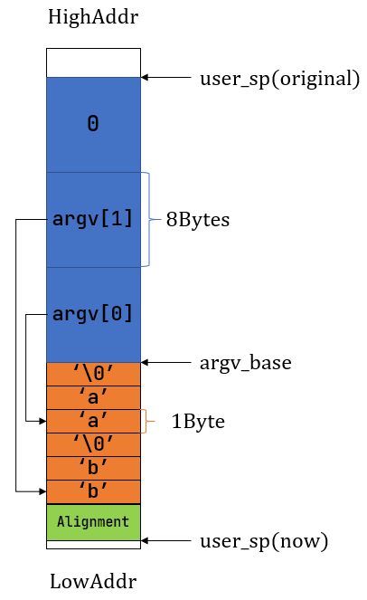

# ch7实现了管道、命令行参数与标准I/O重定向、信号
信号的部分[rcore-camp-guide](https://learningos.cn/rCore-Camp-Guide-2025S/chapter7/index.html)没讲，得看[rcore-tutorial](https://rcore-os.cn/rCore-Tutorial-Book-v3/chapter7/index.html)。

这里多的不写了，就写两个我以前只能靠想，不能完全理解的东西。

## main函数的命令行参数被放在哪里？如何传递给main()？
参考[rcore-tutorial](https://rcore-os.cn/rCore-Tutorial-Book-v3/chapter7/3cmdargs-and-redirection.html#sys-exec):

通过`exec(path: &str, args: &[*const u8])`启动应用时，比如应用传入了两个命令行参数 aa 和 bb ：



---

命令行参数就是直接放到用户的栈中的，不是说非要是函数调用才能往用户栈中放东西。os/在`sys_exec(path: &str, args: &[*const u8])` -> `exec(&self, elf_data: &[u8], args: Vec<String>)`中，往用户栈中推入参数，并修改 Trap 上下文中的 a0/a1 寄存器，让 a0 表示命令行参数的个数，而 a1 则表示图中 argv_base 即蓝色区域的起始地址。这两个参数在第一次进入对应应用的用户态的时候会被接收并用于还原命令行参数(argc和argv)。（函数调用规范，第一个参数放a0，第二个参数放a1）

user/src/lib.rs中还展示了怎么把argv转化为rust风格的编写应用的时候看到的 &[&str] 的形式：
```Rust
// user/src/lib.rs

#[no_mangle]
#[link_section = ".text.entry"]
pub extern "C" fn _start(argc: usize, argv: usize) -> ! {
    clear_bss();
    unsafe {
        HEAP.lock()
            .init(HEAP_SPACE.as_ptr() as usize, USER_HEAP_SIZE);
    }
    let mut v: Vec<&'static str> = Vec::new();
    for i in 0..argc {
        let str_start =
            unsafe { ((argv + i * core::mem::size_of::<usize>()) as *const usize).read_volatile() };
        let len = (0usize..)
            .find(|i| unsafe { ((str_start + *i) as *const u8).read_volatile() == 0 })
            .unwrap();
        v.push(
            core::str::from_utf8(unsafe {
                core::slice::from_raw_parts(str_start as *const u8, len)
            })
            .unwrap(),
        );
    }
    exit(main(argc, v.as_slice())); // 调用main函数并以main的返回值退出
}
```

## 信号处理函数在哪里被调用
（一个一直不清楚的问题，看rcore明白了）

当进程使用signal注册信号处理函数后，发生相应事件时，事件的发生是由操作系统检测到的，那么操作系统在怎样的上下文中完成信号处理函数的调用？

首先肯定不能在内核态执行用户提供的信号处理函数，否则信号处理函数中写个死循环os就出不去了。必须在用户态执行，那么，信号处理函数所用的栈又是哪个？

参考[rcore-tutorial](https://rcore-os.cn/rCore-Tutorial-Book-v3/chapter7/4signal.html#id4)：

信号有两种来源：最开始的时候进程在正常执行，此时可能内核或者其他进程给它发送了一个信号，这些就属于异步信号，是信号的第一种来源；信号的第二种来源则是由进程自身的执行触发，在处理 Trap 的时候内核会将相应的信号直接附加到进程控制块中，这种属于同步信号。

内核会在 Trap 处理完成即将返回用户态之前**检查要返回到的进程是否还有信号待处理**。并调用相应的信号处理函数。

信号的产生有以下几种方式：

1. 进程通过 kill 系统调用给自己或者其他进程发送信号。

2. 内核检测到某些事件给某个进程发送信号，但这个事件与接收信号的进程的执行无关。典型的例子如： SIGCHLD，当子进程的状态改变后由内核发送给父进程。

3. 前两种属于异步信号，最后一种则属于同步信号：即进程执行的时候触发了某些条件，于是在 Trap 到内核处理的时候，内核给该进程发送相应的信号。比较常见的例子是进程执行的时候出错，比如段错误 SIGSEGV 和非法指令异常 SIGILL 。

为了与其他进程进行通信，一个进程可以使用 kill 系统调用发送信号给另一个进程：

```Rust
// user/src/lib.rs

/// 功能：当前进程向另一个进程（可以是自身）发送一个信号。
/// 参数：pid 表示接受信号的进程的进程 ID, signum 表示要发送的信号的编号。
/// 返回值：如果传入参数不正确（比如指定进程或信号类型不存在）则返回 -1 ,否则返回 0 。
/// syscall ID: 129
pub fn kill(pid: usize, signum: i32) -> isize;
```
kill 这个函数名有误导性，应该是历史原因。看名字是用来发 SIGKILL 信号的，但是实际功能是可以发任意一种信号。

在 trap_handler 完成 Trap 处理并返回用户态之前，会调用 handle_signals 函数处理当前进程此前接收到的信号。

**handle_signals 如何完成信号处理函数的运行？**

TaskControlBlock 中增加了一个字段`trap_ctx_backup: Option<TrapContext>`，表示进程执行信号处理例程之前的 Trap 上下文。因为我们要 Trap 回到用户态执行信号处理例程，原来的 Trap 上下文会被覆盖，所以我们将其保存在进程控制块中。

调用信号处理例程前，将当前的 Trap 上下文保存在`trap_ctx_backup`中。然后修改 Trap 上下文的 sepc 到应用设置的例程地址使得 Trap 回到用户态之后就会跳转到例程入口并开始执行。注意我们并没有修改 Trap 上下文中的 sp ，这意味着例程还会在原先的用户栈上执行。这是为了实现方便，在 Linux 的实现中，内核会为每次例程的执行重新分配一个用户栈。最后，我们修改 Trap 上下文的 a0 寄存器，使得信号类型能够作为参数被例程接收。（sig_handler的第一个参数是信号编号）

然后在rcore的实现中，要求用户手动在信号处理例程的结尾插入`sigreturn`这个系统调用来结束信号处理并继续进程原来的执行。`sigreturn`将进程控制块中保存的记录了处理信号之前的进程上下文的 trap_ctx_backup 覆盖到当前的 Trap 上下文。这样接下来 Trap 回到用户态就会继续原来进程的执行了。

**总结一下**，内核返回用户态之前会先检查要运行的进程是否接收到了信号要处理，如果要调用信号处理函数的话，则把当前 Trap 上下文（这个 Trap 上下文是返回到用户程序原本执行流的上下文）保存到进程控制块的`trap_ctx_backup`中，然后把 TrapContext 改了一下，使之会返回到执行信号处理函数，然后信号处理函数运行完后，调`sigreturn`系统调用，`sigreturn`会用`trap_ctx_backup`这个 TrapContext 返回用户程序原本的执行流。这样就完成了信号处理机制。

在rcore的实现中，信号处理函数的执行设计为**直接使用原先的用户栈**，这与实际Linux不同，指导书中说了这个。

还有一点是，rcore的实现要求用户手动在信号处理函数的结尾插入`sigreturn`这个系统调用，这也与Linux下的signal函数不同。

## Linux下，使用glibc的signal()注册信号处理函数时，为什么不需要手动调sigreturn()
rcore的实现，在 sig_handler 执行完毕后，需要手动调用 sigreturn 这个系统调用完成返回到用户程序原本的执行流。linux是有[sigreturn](https://man7.org/linux/man-pages/man2/sigreturn.2.html)这个系统调用的（编号为2，是系统调用），rcore这一点上也是还原的。且sigreturn的manpage里提到了sig_handler返回后会跑到一个叫"signal trampoline"的地方，signal trampoline会调sigreturn():

If the Linux kernel determines that an unblocked signal is pending for a process, then, at the next transition back to user mode in that process (e.g., upon return from a system call or when the process is rescheduled onto the CPU), it creates a new frame on
the user-space stack where it saves various pieces of process context (processor status word, registers, signal mask, and signal stack settings).

The kernel also arranges that, during the transition back to user mode, the signal handler is called, and that, upon return from the handler, control passes to a piece of user-space code commonly called the "signal trampoline".  The signal trampoline code in
turn calls sigreturn().

linux 下实际使用 signal() 注册信号处理函数时，并不要求用户在 sig_handler 末尾手动调用 sigreturn()，这是为什么？

首先，**用到的 signal.h 里的 signal() 实际是 glibc 的函数**，glibc 的 signal() 应该是调用 [sigaction()](https://man7.org/linux/man-pages/man2/sigaction.2.html) 完成工作的，sigaction 这个系统调用还有个 sa_restorer 字段，glibc 应该是有个 signal trampoline 函数，单单做了调用 sigreturn() 这一件事，然后 glibc 自己知道这个函数的地址，可以把它通过 sigaction 注册给内核。这样内核就知道该给 sig_handler 准备的 ra 的值是多少（内核把 signal trampoline 的地址推到 sig_handler 的调用栈里，这样 sig_handler ret 后就会跳到 signal trampoline），sig_handler 返回后去调那个调了 sigreturn() 的函数（用户态），这样就能实现自动调用 sigreturn() 了。

不过还有个系统调用版本的 [signal()](https://man7.org/linux/man-pages/man2/signal.2.html)，直接用这个的话是不是得手动写 sigreturn() 了？

还有个比较eval的想法，或许也能实现sig_handler结束后自动调sigreturn。linux内核调用信号处理函数前，先往栈帧中推调用sigreturn()这个系统调用的汇编代码，就是往栈中推 ecall sigreturn 的相关内容，然后推ra为ecall ...的地址，这样sig_handler()返回时就会在用户态触发调用ecall sigreturn。这样就实现了自动调 sigreturn()。（单纯我的想象，这样有点怪，因为这样操作把调用栈中的内容当代码段用了。）